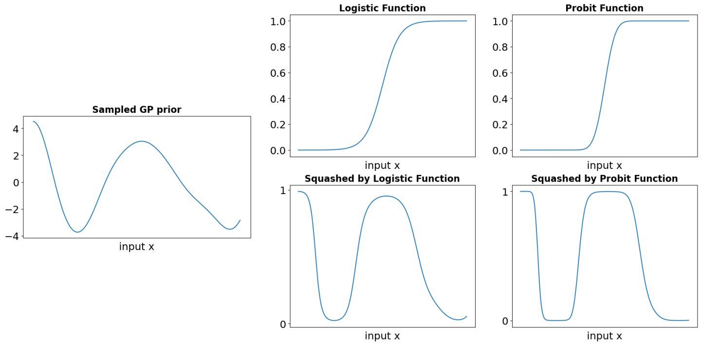
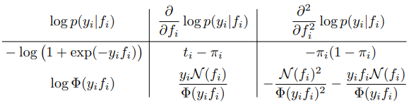
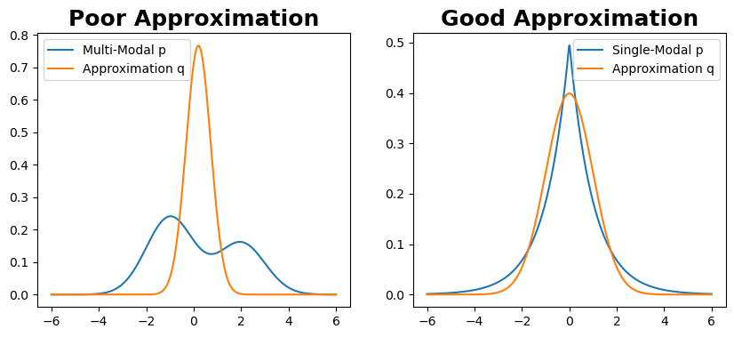
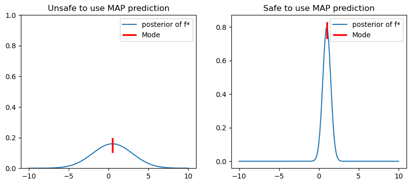

## Introduction

In a previous article, we briefly explained the application of Gaussian processes to regression problems. Apart from regression, classification is another important type of problem. Both regression and classification problems can be categorized as 'finding a function mapping from input $x$ to output $y$'. However, compared to regression problems, Gaussian processes encounter many challenging issues when dealing with classification problems. This article will elucidate these issues and provide corresponding solutions.

## 1. Review: Gaussian Process Regression
A Gaussian process is a stochastic process where any point $x\in R^d$ is assigned a random variable $f$ and the joint distribution of these variables follows a Gaussian distribution $f|x\sim\mathcal{N}(\mu,K)$. Gaussian process is a prior over functions, whose shape (smoothness, etc.) is defined by the mean function $\mu$ and the covariance $K=k(X,X)$ where k is a parameterized kernel function. For $\mu$, we generally set it to 0 (ie. $\mu(\,\cdot\,)=0$). Given a set of input values $X$ and their corresponding noisy observations $y$, we want to predict the function value $f^*$ at the new point $x^*$. The joint distribution of the observed values
$y$ and the predicted value $f^*$ is a Gaussian distribution, which has the following form:

$$
y,f^*|X,x^*\sim\mathcal{N}(\begin{bmatrix}             y\\            f^*\\          \end{bmatrix}|\,0,\begin{bmatrix}             K_y&k_*\\            k_*&k_{**}\\          \end{bmatrix})\,\,\,\,\,\,\,\,\,\,\,\,\,\,\,\,(\text{Recap 1.})
$$

$K_y=K+\sigma_y^2I$, $k_*=k(X,x_*)$, and $k_{**}=k(x^*,x^*)$. $\sigma_y^*$ is used to model the noise in the observed values. By applying Bayes' theorem to the joint distribution above, we obtain the predictive distribution for $f^*$: 

$$
f^*|x_*,X,y\sim\mathcal{N}(f^*|\mu_*,\Sigma_*)
$$


$$
\text{where}\,\,\mu_*=k_*^TK_y^{-1}y\,\,,\,\Sigma_*=k_{**}-k_*^TK_y^{-1}k_*\,\,\,\,\,\,\,\,\,\,\,\,(\text{Recap 2.})
$$

You can check the [previous article](https://yyimingucl.github.io/post/gpr/) for more information.

## 2. Binary Classifcation Problem
In classification problems, our target variable $y$ is no longer continuous, but rather discrete: $y = \{+1, -1\}$. Clearly, we can no longer assume that $y|x$ follows a Gaussian distribution as in regression problems. A suitable choice is the Bernoulli distribution $y|x \sim Bernoulli(\theta): p(y=+1|x) = \theta, p(y=-1|x) = 1-\theta$, where $\theta \in [0,1]$. In fact, once we have a good estimate for $\theta$, the classification problem is solved (from a discriminative point of view. Another way of looking at classification problems, called the generative perspective, aims to estimate the joint distribution of $y$ and $x$, which is not discussed here). But how can we estimate $\theta$? There are many methods for estimating $\theta$, such as linear models (logistic regression), neural networks (convolutional neural networks in image recognition), etc. Our title is Gaussian process classification, so naturally we will discuss how to use Gaussian processes to estimate $\theta$.

Can we directly treat $\theta$ as a regression variable ($y$) and use a Gaussian process to obtain $\theta|x \sim\mathcal{N}(\mu, K)$. The answer is obviously no. There are two reasons for this: (1) the range of $\theta$ obtained from the Gaussian process is $(-\infty,\infty)$, which does not satisfy the requirement that $\theta\in[0,1]$, and (2) although we want to estimate $\theta$, we cannot directly observe $\theta$. We can only observe $y$ produced by $\theta$. To address the first issue, we can use a response function $\sigma(\,\cdot\,)$ to compress the results obtained from the Gaussian process into the $[0,1]$ range. Common response functions include the logistic function and the cumulative probability function of the standard Gaussian distribution (probit function). The figure below shows these two functions, as well as the compressed Gaussian process prior:

## 3. Gaussian Process Classification (GPC)
For distinctions, we denote the regression variable of the Gaussian process as the (latent) variable $f: f|x \sim \mathcal{N}(\mu, K)$. With the response function $\sigma$ introduced in the previous paragraph, we can obtain the likelihood function. For a sample $(xi, yi)$, their likelihood is given by: 

$$
\begin{equation} p(y_i|x_i,f_i)=\left\{ \begin{array}{ll}       \sigma(f_i(x_i)), & y_i=+1 \\       1-\sigma(f_i(x_i)), & y_i=-1 \\ \end{array}  \right.  \end{equation}
$$

Due to the symmetry of the response function: $\sigma(-z)=1-\sigma(z)$, the likelihood can be expressed more concisely as $p(y_i|x_i,f_i)=\sigma(y_if_i(x_i))$. It's interesting that for the latent variable f, we don't observe its value (only observe input ${x_i}_i$ and target values ${y_i}_i$) and we are not interested in it at all. The existence of $f$ is only for the convenience of modeling discrete y and making the model structure clearer. What we are really interested in is $\pi(x) = p(y=1|x)$, especially for new input $x^*$, and note that $\pi(x)$ no longer depends on $f$. So **how do we remove this dependence?**

Given the sample $\{X,y\}$, the prediction distribution for a new input $x^*$ can be expressed as:

$$
\pi(x^*)=p(y^*=1|X,y,x^*)=\int\sigma(f^*)p(f^*|X,y,x^*)\,df^*\,\,\,\,\,\,\,\,(1)
$$


$$
p(f^*|X,y,x^*)=\int p(f^*|X,x^*,f)p(f|X,y)\,df\,\,\,\,\,\,\,\,\,\,\,\,(2)
$$

$p(f|X,y)=\frac{p(y|f)p(f|X)}{p(y|X)}$ is the posterior distribution of latent variable $f$. If we want to solve (1), there are two tricky problems: 1. The posterior distribution of the latent variable $f, p(f|X,y)$, is no longer a Gaussian distribution (where $p(y|f) = \sigma(yf)$ is a non-Gaussian likelihood). 2. The non-linear function $\sigma$ applied to $f^*, \sigma(f^*)$. These two issues make the integration in (1) no longer have a closed-form solution like in regression problems. Approximation is inevitable in this case. This leads us to our second question: **how to approximate the integration in (1)?** Two commonly used methods are given below: 1. Laplacian approximation and 2. Expectation propagation. 

## 4. Laplacian approximation
### 4.1 Introduction
The idea of Laplacian approximation is simple: approximate an unknown distribution $p$ using a Gaussian distribution $q$. The question is, **how do we determine the parameters $\mu$ and $\Sigma$ of the Gaussian distribution $q$?** Let's start by introducing Laplace's method briefly. Suppose we know that a function $g(x)$ attains its maximum at $x_0$, and we want to evaluate the integral $\int_a^b g(x)dx$.

$$
\begin{split} 
&\text{Firstly, we define} h(x)=\log(g(x))\\ 
&\Rightarrow \int_a^bg(x)\,dx = \int_a^b\exp(h(x))\,dx\\ 
&\text{Take Second order Taylor expansion of} h(x) \text{at} x_0}\\ 
&\Rightarrow\int_a^b \exp(h(x_0)+h'(x_0)(x-x_0)+\frac{1}{2}h''(x_0)(x-x_0)^2)\,dx\\ 
&\text{we know} g(x) \text{will be maximum at} x_0\\ 
&\text{and} h(x) \text{will also be maximum at} x_0 \Rightarrow h'(x_0)=0\\ 
&\Rightarrow\int_a^bg(x)\,dx\approx\\ 
&\exp(h(x_0))\sqrt{2\pi h''(x_0)}\int_a^b\underbrace{\frac{1}{\sqrt{2\pi h''(x_0)}}\exp(\frac{1}{2}h''(x_0)(x-x_0)^2)}_{\mathcal{N}(x_0,h''(x_0))}\,dx\\ 
&\Rightarrow \text{we only need to find} x_0 \text{and compute} h''(x_0)\\
&\text{then we can get the approximate of desired integral}  
\end{split}
$$


### 4.2 Posterior distribution $p(f|X,y)$
Roughly speaking, under the second-order Taylor approximation, $g(x)$ is proportional to $\mathcal{N}(x_0, h^{''}(x_0))$. By replacing $g(x)$ with the posterior $p(f|X, y)$ in the above derivation and performing a second-order Taylor expansion around the maximum value $\hat{f}$, we can determine the parameters $\mu$ and $\Sigma$ of the approximate distribution $q$.

$$
q(f|X,y)=\mathcal{N}(f|\hat{f},\,A^{-1})\propto \exp{(-\frac{1}{2}(f-\hat{f})^TA(f-\hat{f}))}\,\,\,\,\,\,\,\,\,(3)
$$

(Jumping out of the discussion on this article or Gaussian processes, Laplace's approximation has much broader applications. It is highly recommended that you learn about this method itself. You can refer to this blog post - [Laplace's Method](https://gregorygundersen.com/blog/2019/05/08/laplaces-method/).), where $\hat{f}=\arg\max_f\,p(f|X,\,y)$, $A=-\nabla\nabla\log p(f|X,y)|_{f=\hat{f}}$. The next question is: **how to find $\hat{f}$ and its corresponding Hessian matrix $-\nabla\nabla\log p(\hat{f}|X,y)$?**

$$
\begin{split} \log p(f|X,y)&=\log p(y|f)+\log p(f|X)-\log p(y|X)\\ &\text{take derivative wrt $f$，$\log p(y|X)$ can be viewed as constant}\\ &\propto \log p(y|f)+\log p(f|X)\\ &f|X\sim\mathcal{GP}(\mu(X),K(X,X))\\ &=\log p(y|f) - \frac{1}{2}f^TK^{-1}f-\frac{1}{2}\log|K|-\frac{n}{2}\log2\pi \\ &=\Psi(f)\,\,\,\,\,\,\,\,\,(4) \end{split}
$$

Take derivative of (4) with respect to $f\Rightarrow$

$$
&\nabla\Psi(f)=\nabla\log p(y|f)-K^{-1}f}\,\,\,\,\,\,\,\,\,\,\,\,\,\,\,\,\,\,\,\,\,\,\,\,\,\,\,\,\,\,\,\,\,\,\,\,\,\,\,\,\,\,\,\,\,\,\,\,\,\,\,(5)
$$
 

$$
\nabla\nabla\Psi(f)=\nabla\nabla\log p(y|f)-K^{-1}=-W-K^{-1}\,\,\,\,\,\,\,(6) 
$$
 
where $W=-\nabla\nabla\log p(y|f)$ It should be noted that because we assume that each sample $(x_i, y_i), (x_j, y_j)$ is independent, this means that their corresponding latent variables $f_i, f_j$ are also independent of each other. So the matrix $W$ we obtain is a diagonal matrix, which greatly simplifies our calculations. Recall that $p(y|f) = \sigma(y_i f_i)$, where $\sigma(\,\cdot\,)$ has many choices. Below are the logarithmic forms, first-order derivatives, and second-order derivatives of two commonly used functions: the logistic function and the Probit function:
||
|:--:| 
|*Table from [2]. The first row is for the logistic function and the second is for the probit function.*|
In the case of $f = \hat{f}$, our first-order derivative $(5) = 0 \Rightarrow \hat{f} = K(\nabla \log p(y|\hat{f}))$. However, $\nabla \log p(y|\,\cdot\,)$ is nonlinear, and we cannot directly solve it. 

Here, we can use Newton's method for iteration:

$$
\begin{split} 
f^{\text{new}}&=f-(\nabla\nabla\Psi)^{-1}\nabla\Psi\\
              &=f+(K^{-1}+W^{-1})^{-1}(\nabla\log p(y|f)-K^{-1}f)\\ 
              &=(K^{-1}+W)^{-1}(Wf+\nabla\log p(y|f)) 
\end{split}
$$
 
After finding $\hat{f}$ and its Hessian matrix (6), we can obtain the posterior distribution of Laplace's approximation:

$$
q(f|X,y)=\mathcal{N}(\hat{f},(K^{-1}+W)^{-1})\,\,\,\,\,\,\,\,\,\,\,\,\,\,\,\,\,\,\,\,\,\,\,(7)
$$

The biggest drawback of using Laplace's approximation is that the approximate distribution $q$ we obtain may differ greatly from the true distribution $p$. This is because we only use the mean $\mu$ and covariance $\Sigma$ of the $p$ distribution as parameters of the Gaussian distribution $q$. However, this information may (1) be far from sufficient to fully describe the distribution $p$ or (2) not correctly reflect the characteristics of the distribution $p$, such as if $p$ is a long-tail distribution or a multi-modal distribution.
||
|:--:| 
|*Laplace's approximation: (left) using Laplace's approximation for a multi-modal distribution p will lead to a very poor approximation q; (right) using Laplace's approximation for a unimodal distribution p will result in a good approximation q.*|

### 4.3 Predication 
By using Laplace's approximation, we can substitute the approximate posterior distribution $q(f|X,y)$ (equation 7) into the predictive mean (Recap 2) of the regression problem, and obtain the mean of the predictive distribution for a new input $x^*$:

$$
\mathbb{E}_q(f^*|X,y,x^*)=k_*^TK^{-1}k_*=k_*^T\nabla\log p(y|\hat{f})\,\,\,\,\,\,\,\,\,\,\,(8)
$$

If we carefully observe equation (8), we can express the expectation of the approximate distribution $q$ as:

$$
\mathbb{E}_q(f^*|X,y,x^*)=\sum_{i=1}^nk(x^*,x_i)\nabla\log p(y_i|\hat{f}_i)
$$

Referring to the second column in the table above, we can see that for a positive sample $(y_i=+1), \nabla\log p(y_i|f^i)\ge0$. Similarly, a negative sample will result in $\nabla\log p(y_i|f_i)\le0$. Simply put, when making the final classification, we determine which class y* belongs to based on the sign of $E_q$. If $x^*$ is very similar to a positive sample $x_i$ ($x_i$ is highly likely to belong to the same class as $x_i\Rightarrow k(x^*,x_i)$) will be very large $\Rightarrow k(x^*,x_i)\nabla\log p(y_i|f^i)$ will pull $E_q$ towards a positive value. Conversely, if it is a negative sample, $E_q$ will be pulled towards a negative value. The whole principle is very similar to the support vector machine method (kernel), except that we replace the product of the coefficient and label $c_iy_i$ with $\nabla\log p(y_i|f_i)$.

At the same time, we can notice that for a sample $(x_i,y_i)$ that is easy to classify or can be well-explained by our model, its likelihood will approach 1, $p(y_i|f_i)\to1$ and its logarithmic likelihood approaches 0, $\log p(y_i|x_i)\to0$. $\Rightarrow k(x^*,x_i)\nabla \log p(y_i|f_i)\to0$, which will not have a significant impact on predicting $y^*$. This is also very similar to the non-support vector in support vector machines!

To classify $x^*$ only, we can directly use the response function to "squeeze" the $E_q$ obtained in Equation (8) into the range $[0,1]$ to obtain the probability of $y^*=1, \pi(x^*)=\sigma(E_q(f^*|X,y,x^*))$. Since we are discussing a binary classification problem, we can simply classify as follows:

$$
\begin{equation}y^*=\left\{ \begin{array}{ll}       1 & \hat{\pi}(x^*)\ge\frac{1}{2} \\       -1 & \hat{\pi}(x^*)<\frac{1}{2} \\ \end{array}  \right.  \,\,\,\,\,\,\,\,\,\,\,\,\,\,\,\,(9)\end{equation}
$$

Since we only calculated the 'maximum' value of the posterior distribution of $f^*$ (in Gaussian distribution, mean=mode=probability peak value), this method is called 'Maximum a posteriori estimation' (MAP) prediction.

However, sometimes we need to know how 'confident' our prediction is. (For example, in medical applications, if the confidence value is too low, we reject the result). In such cases, we need to calculate the expectation of $\pi(x^*)$ in formula (1):

$$
\bar{\pi}(x^*)=\mathbb{E}_q(\pi(x^*)|X,y,x^*)=\int\sigma(f^*)q(f^*|X,y,x^*)\,df^*\,\,\,\,\,\,\,\,(10)
$$

Recall that $\pi(x^*) = p(y^*=1|x^*)$, where $p$ is the parameter of a Bernoulli distribution. Why can the expectation of $\pi(x^*)$ reflect the credibility of the result? And what is the difference between it and maximum a posteriori prediction? The blue curve in the following two figures represents the posterior distribution $q(f^*|X, y, x^*)$, and the red line represents the maximum a posteriori. In the case of the left figure, the posterior distribution of $f^*$ has a large variance. When using simple maximum a posteriori prediction, $\hat{\pi}(x^*) \ge 1/2$, and it will be classified as $y^*=+1$, but this is a very risky behavior because a considerable portion of $f^*$ is distributed in negative values, so $\sigma(f^*)\le1/2$ will give $y^*=-1$. For this case, Formula (10) considers all possible $f^*$ and obtains $\pi(x^*)$ that is much smaller than $\pi(x^*)$. At this point, we can reject the classification result to avoid serious consequences caused by misclassification. The corresponding situation on the right figure is that $\pi(x^*)$ is approximately equal to $\pi(x^*)$, and we can confidently use the MAP prediction result.
||
|:--:| 
|*(Left) Unreliable situation of MAP prediction, (Right) Reliable situation of MAP prediction.*|
From the graph, we can see that the variance of the posterior distribution is the key factor that differentiates equation (8) and equation (10). We can calculate the variance of the posterior distribution, $\mathbb{V}_q(f^*|X,y,x^*)$, to determine whether to use equation (10). Similarly, due to the existence of $\sigma(f^*)$, equation (10) also needs to be approximated or calculated using sampling methods. The calculation of $\mathbb{V}_q(f^*|X,y,x^*)$ and the computation of equation (10) are both detailed in [2] 3.4.2, so we will not go into further detail here.

## 5. Expectation Propagation - EP
* In this derivation, the response function $\sigma$ used is the cumulative probability function $\Phi$ (probit function) of the standard normal distribution: $p(y_i|f_i) = \Phi(f_i y_i)$
### 5.1 Introduction 
Compared to the global approximation of Laplace's method, Expectation Propagation (EP) updates the global approximation by iterating through and updating each local approximation until convergence. First, we decompose the likelihood:

$$
p(f|X,y)=\frac{1}{Z}p(f|X)\prod_{i=1}^np(y_i|f_i)
$$


$$
Z=p(y|X)=\int p(f|X)\prod_{i=1}^np(y_i|f_i)\,df
$$

For the non-Gaussian likelihood of each sample, we make the following approximation:

$$
p(y_i|f_i) \simeq t_i(f_i|\tilde{Z}_i,\tilde{\mu}_i,\tilde{\sigma}^2_i)=\tilde{Z}_i\mathcal{N}(f_i|\tilde{\mu}_i,\tilde{\sigma}_i^2)\,\,\,\,\,\,\,\,\,\,\,\,\,\,\,\,\,\,\,\,\,\,\,\,\,(11)
$$

where $\tilde{Z}_i,\tilde{\mu}_i,\tilde{\sigma}^2_i$ is called the site parameters for approximating the likelihood of sample $i$, it is interesting to note that we are using an unnormalized Gaussian distribution of fi to approximate a Gaussian distribution of $y_i$. Upon careful consideration, this approximation is reasonable. We can consider the likelihood $p(y_i|f_i)$ as a conditional probability distribution of $y_i$ given $f_i$. Since $y_i$ is fixed, we are more concerned about $f_i$ and want to know how $f_i$ affects or explains our target value $y_i$. In other words, if the likelihood is a function of $f_i$, we are more interested in how the likelihood changes with $f_i$. (In regression problems, the distribution of $y_i|f_i$ is also determined by the selected distribution of $f_i$. The difference is that in regression problems, we can directly calculate the distribution of $y_i|f_i$, while in classification problems, an approximation is needed.) Since the approximate likelihood of each sample is Gaussian, we can obtain: $\prod_{i=1}^nt_i(f_i|\tilde{Z}_i,\tilde{\mu}_i,\tilde{\sigma}^2_i)=\mathcal{N}(\tilde{\mu},\tilde{\Sigma})\prod_i\tilde{Z}_i$ where $\tilde{\mu}=(\tilde{\mu}_1,...,\tilde{\mu}_n)\,\,\text{and}\,\,\tilde{\Sigma}\,\,\text{is diagnoal}\,\,\tilde{\Sigma}_{ii}=\tilde{\sigma}^2_i$

Then we will define the approximate distribution $q(f|X,y)$:

$$
\begin{split} &q(f|X,y)=\frac{1}{Z_{EP}}p(f|X)\prod_{i=1}^nt_i(f_i|\tilde{Z}_i,\tilde{\mu}_i,\tilde{\sigma}^2_i)=\mathcal{N}(\mu,\Sigma)\\ &\text{with}\,\,\mu=\Sigma\tilde{\Sigma}^{-1}\tilde{\mu},\,\,\text{and}\,\,\Sigma=(K^{-1}+\tilde{\Sigma}^{-1})^{-1} \end{split}\,\,\,\,\,\,\,\,\,\,\,\,\,\,\,\,\,\,\,\,\,\,\,\,\,(12)
$$

It is important to note that $\tilde{\mu},\tilde{\Sigma}$ are the parameters of the local likelihood approximation, while $\mu,\Sigma$ are the parameters of the global approximate posterior distribution $q$, and $Z_{EP}$ is the normalization constant obtained from the EP algorithm. After defining all of the above, the core problem that the EP algorithm solves arises: **how should we choose the parameters of the local approximate distribution $t_i$: $\tilde{\mu}_i,\tilde{\sigma}_i, \tilde{Z}_i$?** The main idea of the entire EP algorithm is to update each $t_i$ sequentially. In general, the EP method iterates through the following four steps:
1. By removing the likelihood $t_i$ of the sample $(x_i,y_i)$, We compute the marginal distribution of $f_i$ from the current approximate posterior distribution $q(f_i|X,y)$, denoted as $q_{-i}(f_i)$. Since it looks like we dig a 'hole' around the sample, the distribution $q_{-i}(f_i)$ is called 'cavity' distribution. 
2. We replace the approximate likelihood $t_i$ by the true likelihood $p(y_i|f_i)$ to fill the 'hole', thereby obtaining a new marginal distribution $q_{-i}(fi)p(y_i|f_i)$ about $f_i$.
3. The marginal distribution obtained in the second step is not a Gaussian distribution, so we need to find an approximate Gaussian distribution $\hat{q}(f_i)$ for it.
4. In the final step, we calculate the parameters of the approximate likelihood $t_i (\hat{q}(f_i) = t_iq_{-i}(f_i))$, where  $\hat{q}(f_i)$ and $q_{-i}(f_i)$ are known through steps 1 and 3.

Below we will explain these four steps one by one:

The goal of EP is to optimize the local approximation $t_i$ one by one based on the existing local approximations $\{t_j\}_{j\neq i}$. Consider what information is useful for constructing the posterior distribution $f_i$: 1. The prior $p(f_i|X)$. 2. The local approximation distribution $\{t_j\}_{j\neq i}$ for each sample. 3. The true likelihood $p(y_i|f_i) = \sigma(y_if_i)$ for sample $i$. Our goal is to integrate all this information to construct the required approximate distribution. First, we combine the prior with the likelihoods of other samples (except sample $i$) to obtain the cavity distribution $q_{-i}(f_i)$:

$$
q_{-i}(f_i)\propto\int p(f|X)\prod_{j\neq i}t_j(f_j|\tilde{Z}_j,\tilde{\mu}_j,\tilde{\sigma}^2_j)\,df_j\,\,\,\,\,\,\,\,\,\,\,\,\,\,\,\,\,\,\,\,(13)
$$

Afterwards, the true likelihood of sample i will be combined with (13). To compute $q_{-i}(f_i)\,\,(13)$, we need to take two steps:
1. Marginalize $f_i$ from the approximate distribution of the overall $q(f|X,y)$ to obtain $q(f_i|X,y)$. There are two points to note here: (1) $q(f|X,y)$ is a Gaussian distribution, and through the marginal property of the Gaussian distribution, we can easily obtain $q(f_i|X,y)=\mathcal{N}(f_i|\mu_i,\sigma_i^2)$ where $\sigma^2=\Sigma_{ii} (\Sigma in (12))$. (2) The $q(f_i|X,y)$ obtained here does not remove $t_i$

$$
q(f_i|X,y)=\int p(f|X)t_i(f_i|\tilde{Z}_i,\tilde{\mu}_i,\tilde{\sigma^2_i})\prod_{j\neq i}t_j(f_j|\tilde{Z}_j,\tilde{\mu}_j,\tilde{\sigma}^2_j)\,df_j
$$

Therefore, we need to divide by $t_i$ to obtain the cavity distribution $q_{- i} (f_i)= \frac{q(f_i|X,y)}{t_i}$. The cavity distribution obtained here is still a Gaussian distribution, and one easy way to understand it is that the product of two Gaussian variables is still a Gaussian distribution ($q(f_i|X,y) = q_{- i} (f_i)\times t_i$, we can reverse to obtain $q_{- i }(f_i)$) by using known $q(f_i|X,y),t_i$. 

$$
\begin{split} \Rightarrow &\,\,q_{- i }(f_i)=\mathcal{N}(f_i|\mu_{- i},\sigma_{- i}^2) \\ &\text{where}\,\,\mu_{- i }=\sigma_{- i }^2(\sigma_i^{-2}\mu_i-\tilde{\sigma}_i^{-2}\tilde{\mu}_i)\,,\,\,\text{and}\,\,\sigma_{- i }^2=(\sigma_i^{-2}-\tilde{\sigma}_i^{-2})^{-1}  \end{split}  \,\,\,\,\,\, \,\,\,\,\,\, \,\,\,\,\,\, \,\,\,\,\,\, \,\,\,\,\,\, (14)
$$


2. & 3. Next, we need to incorporate the true likelihood $p(y_i|f_i)$ into the constructed cavity distribution $q_i^-(f_i)p(y_i|f_i)$ to approximate $q(f_i|X,y)$. However, this product is not a Gaussian distribution, so we need to find a Gaussian approximation for this product:

$$
\Rightarrow\hat{q}(f_i)\triangleq \hat{Z}_i\mathcal{N}(\hat{\mu}_i,\hat{\sigma}_i^2)\simeq q_{-i }(f_i)p(y_i|f_i) \,\,\,\,\,\,\,\,\,\,\,\,\,\,\,\,\,\,\,\,\,\,\,\,\,\,\,\,\,\,\,\,\,\,\,\,\,\,\,\,\,(15)
$$

Here, we minimize the KL divergence between the product and the approximate distribution $\hat{q}(f_i)$ by setting it to be a Gaussian distribution that matches the mean and variance of $q_{-i }(f_i)p(y_i|f_i)$. The equation is $\min_{\hat{q}}KL( q_{-i }(f_i)p(y_i|f_i) \|\hat{q}(f_i))$. After matching the mean and variance, we need to normalize $\hat{q}(f_i)$ by a constant $\hat{Z}_i$ to match it with  $q_{-i }(f_i)p(y_i|f_i)$. Finally, we obtain the parameters of $\hat{q}$: 

$$
\hat{Z}_i=\Phi(z_i),\,\,\,\,\,\hat{\mu}_i=\mu_{-i} + \frac{y_i\sigma^2_{-i}\mathcal{N}(z_i)}{\Phi(z_i)\sqrt{1+\sigma^2_{-i} }},
$$


$$
\hat{\sigma_i^2}=\sigma^2_{-i} -\frac{\sigma^4_{-i}\mathcal{N}(z_i) }{(1+\sigma_{-i}^2)\Phi(z_i)}(z_i+\frac{\mathcal{N}(z_i)}{\Phi(z_i)}) 
$$

where $z_i=\frac{y_i\mu_{-i}}{\sqrt{1+\sigma_{-i}^2}}$ and $\Phi$ is the cumulative distribution function of the standard normal distribution. The complete derivation can be found in section 3.9 [2].

4. Finally, we need to calculate the parameters of the local approximation distribution $t_i$:  $\tilde{Z}_i,\tilde{μ}_i,\tilde{σ}_i^2$. We replace $q(f_i|X,y)$ with the results obtained from the previous two steps $\Rightarrow\hat{q}(f_i)=t_iq_{-i}(f_i)$, and all three distributions here are Gaussian. Through simple calculations, we can obtain: 

$$
\tilde{Z}_i=\hat{Z}_i\sqrt{2\pi}\sqrt{\sigma^2_{- i}+\tilde{\sigma^2_i}}\exp(\frac{1}{2}(\mu_{-i} -\tilde{\mu}_i)^2/(\sigma^2_{-i}+\tilde{\sigma}_i^2)) 
$$

We have now completed the update of the approximate likelihood $t_i$ for sample $i$. Expectation propagation is iteratively applied, updating each local approximation value in turn. Since the update of each local approximation affects the overall approximation, we need to perform multiple updates for each set of samples until the overall likelihood converges.

### 5.2 Predication
Like Laplace approximation, the EP algorithm also approximates the posterior distribution as a Gaussian distribution. For the derivation of the EP predictive distribution, we only need to replace the posterior distribution obtained by Laplace approximation with the approximate posterior obtained by EP, and the remaining derivation is completely identical. The predictive posterior distribution of latent variable $f^*$:

$$
\begin{split}
\text{Mean: }\mathbb{E}_q[f^*|X,y,x^*]&=k_*^TK^{-1}\mu\\
                                      &=k_*^TK^{-1}(K^{-1}+\tilde{\Sigma}^{-1})^{-1}\tilde{\mu}\\
                                      &=k_*^T(K+\tilde{\Sigma})^{-1}\tilde{\mu}
\end{split}
\,\,\,\,\,\,\,\,\,\,(17)
$$


$$
\text{Variance: }\mathbb{V}_q[f^*|X,y,x^*]=k(x^*,x^*)-k_*(K+\tilde{\Sigma})^{-1}k_*\,\,\,\,\,\,\,\,\,\,(18)
$$

From equations (17) and (18), we can obtain the predicted probabilities for binary classification:

$$
q(y^*=1|X,y,x^*)=\mathbb{E}_q(\pi^*|X,y,x^*)=\int\Phi(f^*)q(f^*|X,y,x^*)\,\,df^*
$$

where $q(f^*|X,y,x^*)$ is the predictive distribution of latent variable $f^*$ with mean (17) and variance (18). By computing the integral on the right-hand side of the equation, we obtain the final required predictive probability: $q(y^*=1|X,y,x^*)=\Phi(\frac{k_*(K+\tilde{\Sigma})^{-1}\tilde{\mu}}{\sqrt{1+k(x^*,x^*)-k_*(K+\tilde{\Sigma})^{-1}k_*}})$

## Conclusion 
Actually, Gaussian process classification simply replaces the linear model in logistic regression with a Gaussian process. The difficulty lies in the fact that the Gaussian distribution assumption for the target variable y is not valid. The posterior distribution no longer has a closed-form solution, as in the regression problem, and an appropriate approximation is required. The article briefly introduces two commonly used approximation methods: Laplace approximation and expectation propagation. The Laplace method approximates the posterior distribution globally as a Gaussian distribution, which has the advantage of being simple and fast to compute, but has the disadvantage of being very poor in approximating multi-modal posterior distributions. Expectation propagation iteratively updates the posterior distribution of each sample locally, which has the advantage of relatively good approximation performance for any posterior distribution, but the disadvantage of being computationally complex and cannot guarantee the convergence of the global approximation.

Stepping out of this article or Gaussian process discussion, Laplace approximation has a wider range of applications, and I highly recommend everyone to learn about this method itself. You can refer to this blog post - [Laplace's Method](https://gregorygundersen.com/blog/2019/05/08/laplaces-method/). Similarly, expectation propagation is not only applied in the approximation of Gaussian process classification, but also provides a good idea for the approximation of posterior distributions, and plays a very important role in variational inference.

- Reference:
  * [1] MacKay, David JC. "Introduction to Gaussian processes."NATO ASI series F computer and systems sciences168 (1998): 133-166.
  * [2] Williams, Christopher KI, and Carl Edward Rasmussen.Gaussian processes for machine learning. Vol. 2. No. 3. Cambridge, MA: MIT press, 2006.
  * [3] Minka T P. Expectation propagation for approximate Bayesian inference[J]. arXiv preprint arXiv:1301.2294, 2013.

<!-- ### [❤️ Click here to become a sponsor and help support Wowchemy's future ❤️](https://wowchemy.com/sponsor/)

As a token of appreciation for sponsoring, you can **unlock [these](https://wowchemy.com/sponsor/) awesome rewards and extra features 🦄✨**

## Ecosystem

- **[Hugo Academic CLI](https://github.com/wowchemy/hugo-academic-cli):** Automatically import publications from BibTeX

## Inspiration

[Check out the latest **demo**](https://academic-demo.netlify.com/) of what you'll get in less than 10 minutes, or [view the **showcase**](https://wowchemy.com/user-stories/) of personal, project, and business sites.

## Features

- **Page builder** - Create _anything_ with [**widgets**](https://wowchemy.com/docs/page-builder/) and [**elements**](https://wowchemy.com/docs/content/writing-markdown-latex/)
- **Edit any type of content** - Blog posts, publications, talks, slides, projects, and more!
- **Create content** in [**Markdown**](https://wowchemy.com/docs/content/writing-markdown-latex/), [**Jupyter**](https://wowchemy.com/docs/import/jupyter/), or [**RStudio**](https://wowchemy.com/docs/install-locally/)
- **Plugin System** - Fully customizable [**color** and **font themes**](https://wowchemy.com/docs/customization/)
- **Display Code and Math** - Code highlighting and [LaTeX math](https://en.wikibooks.org/wiki/LaTeX/Mathematics) supported
- **Integrations** - [Google Analytics](https://analytics.google.com), [Disqus commenting](https://disqus.com), Maps, Contact Forms, and more!
- **Beautiful Site** - Simple and refreshing one page design
- **Industry-Leading SEO** - Help get your website found on search engines and social media
- **Media Galleries** - Display your images and videos with captions in a customizable gallery
- **Mobile Friendly** - Look amazing on every screen with a mobile friendly version of your site
- **Multi-language** - 34+ language packs including English, 中文, and Português
- **Multi-user** - Each author gets their own profile page
- **Privacy Pack** - Assists with GDPR
- **Stand Out** - Bring your site to life with animation, parallax backgrounds, and scroll effects
- **One-Click Deployment** - No servers. No databases. Only files.

## Themes

Wowchemy and its templates come with **automatic day (light) and night (dark) mode** built-in. Alternatively, visitors can choose their preferred mode - click the moon icon in the top right of the [Demo](https://academic-demo.netlify.com/) to see it in action! Day/night mode can also be disabled by the site admin in `params.toml`.

[Choose a stunning **theme** and **font**](https://wowchemy.com/docs/customization) for your site. Themes are fully customizable.

## License

Copyright 2016-present [George Cushen](https://georgecushen.com).

Released under the [MIT](https://github.com/wowchemy/wowchemy-hugo-themes/blob/master/LICENSE.md) license. -->
