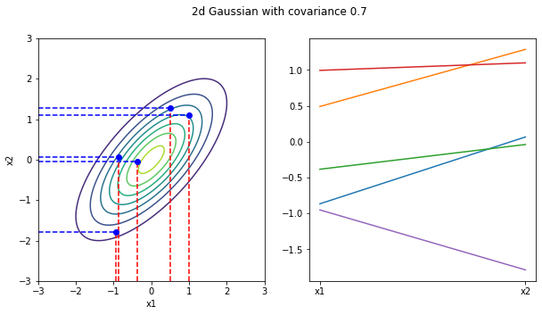

# Overview

In regression problem, we are actually looking for a function that maps input $x$ to output $y$. There are commonly two approaches: 1. We restrict the function space/form (linear, quadratic,...) and optimize their weights to approximate the true function. The problem with this approach is that we need to decide what kind of functions to use, and if the chosen type of function does not naturally match the underlying function, we can never obatin a well-apprxoimated function by only adjusting the weights. 2. The second considers arbitrary functions and chooses the one that fits the given sample $(X, Y)$ more closely (greater likelihood). The problem with this method is that it needs to consider an infinite number of functions, but this is not possible and thus requires the use of the Gaussian process in the title.

Firstly, I will give the definition of [Gaussian Process](https://en.wikipedia.org/wiki/Gaussian_process) from wikipedia: A Gaussian process is a stochastic process (a collection of random variables indexed by time or space) such that every finite collection of those random variables forms a multivariate normal distribution. Remark: **Every finite collection of those random variables forms a multivariate normal distribution**. This property will be our panacea for any upcoming troubles!
correlation

### 1. Two-dimensional Gaussian distribution
From the above definition, it is clear that any number of random variables form a Gaussian distribution. To simplify the problem, we firstly take two of these random variables such that $(x_1,x_2)\sim\mathcal{N}(\mu,\Sigma)$. Three pictures below: (left) Density contours of the distribution. (right) Sampled values of the random variables $x_1,x_2$.
||
|:--:| 
|*cov(x1,x2)=0*|
||
|*cov(x1,x2)=0.7*|
||
|*cov(x1,x2)=0.95*|
As you can see from the graph above, as the correlation between $x_1,x_2$ gets larger, the values of $x_1$ and $x_2$ that we sample become more and more similar. (As can be expected, when the correlation is close to 1, no matter how many times we sample, $x_1$ is always equal to $x_2$. 

### 2. High-dimensional Gaussian distribution
The simple two-dimensional case was studied, let's now extend to 20 dimensions.
||
|:--:| 
|*20-dimensional Gaussian distribution*|

The two left figures above, same as in 2D case, are sampled values for $(x_1,x_2,...x_{20})$ obtained from a 20-dimensional Gaussian distribution (Do the shown curves look like the non-linear regressions?) The right panel shows the covariance matrix, where you can see that variables has a strong correlation with their neighbors (also reflected in the two panes on the left, where the adjacent variables do not vary largely, thus making the whole curve very smooth.)

What if we fix two random variables and sample again?

What if we viewed the two given random variables as given samples in the regression problem? The graph above can be seen as generating four curves that exactly fit the sample. Using the idea of averaging, we sample many curves and then take the average as our regression curve, but this is costly. Luckily, recalling the previous definition of a Gaussian process, the 20 random variables follow a twenty-dimensional Gaussian distribution, and their conditional probability distribution $(x_{3:20}|x_1,x_2\sim Gaussian)$ remains a Gaussian distribution according to the properties of the Gaussian distribution.
|| 
|:--:| 
|*Variance of each random variable (since the first two variables are already given, they can be seen as constants with a variance of zero. In the mean time, the adjacent variabes have a small variance due to the high correlation with the two variables.)*|

**New Question: The above procedure only discusses the discrete case (integer index dimension), but the actual regression problems are often the continuous case.** It is a straightforward idea to sample many times at infinite points (1000 dimensions, 10000 dimensions, ..., and infinite dimensions) around the given sample to approximate a continuous function. However, this approach is extremely ineffective and impossible in fact.

### 3. Gaussian Process Regression
Recall from the previous definition of a Gaussian process that **any number of random variables constitutes a Gaussian distribution**. Generally speaking, if we take an infinite number of random variables will form an infinite-dimensional Gaussian distribution (infinite-dimensional vector of means, infinite-dimensional * infinite-dimensional covariance matrix). And further, if we consider each function as a very very long vector (an infinite-dimensional vector), then the two parameters of the infinite-dimensional Gaussian distribution, the mean and the variance, can be represented by two functions. The entire Gaussian process can then be written in the form: $f(\cdot)\sim\mathcal{N}(m(\cdot), K(\cdot,\cdot))$ where $m(\cdot)\,\,,K(\cdot,\cdot)$ are called the mean function and covariance function respectively. By definition in this way, we can get ride of the limitation of the discrete case and the mean and covariance matrix can be calculated for any function $f(x)$.

From this form, it is possible to view the whole Gaussian process as sampling from a Gaussian distribution defined over functions (functional). Like the finite-dimensional Gaussian distribution, it is uniquely determined by the mean and covariance. Recalling the second approach to solving regression mentioned in the beginning, the Gaussian process does take into account all possible functions. Sampling only from this above form has a very low probability of sampling functions that match the sample points. Therefore, if we wish to obtain functions that match the sample, we need to combine the Gaussian process with given samples. From a Bayesian perspective, it is then possible to think of the Gaussian process as a prior distribution over functions. After combining with the given samples, we get the posterior distribution over functions.

||
|:--:| 
|*m( . )=0 and K( . , .) is gaussian kernel with alpha=2,beta=0.1*|

The figure above shows the 5 functions sampled from the prior distribution of this function. The blue region is $\mu\pm\sigma^2$.

The above figure demonstrates the functions sampled in the posterior distribution, given three samples $(x_1,y_1),(x_2,y_2),(x_3,y_3)$. The thick black line is the mean. It can be seen that, same as in the second part of the 20-dimensional discrete case, the variance around the sample points is almost zero. (Another way to understand the process of combing samples is to reject the functions that do not match these sample points.)

### 4. Covariance Function (Kernel)
For given sample $X=((x_1),(x_2),...,(x_n)$ (each column is the feature for each sample $(x_i)$, then the posterior distribution can be written in the form $f(X)\sim\mathcal{N}(m(X),K(X,X)$ where $[K(X,X)]_{ij}=K(x_i,x_j)$.

Simply starting from the idea of the kernel trick, it is equivalent to quantifies the relationship between points on the feature space induced by the covariance function (though of course the choice of covariance function varies for different situations). Returning to the perspective of the infinite dimensional Gaussian distribution, the covariance function quantifies the relationship between infinitely closed points. In some sense, the covariance function $K(\cdot\,\,,\cdot)$ determines the overall shape of the function (from an a priori perspective, the covaraince function expresses the priori knowledge of the desired function). 

The covariance function and the choice of its hyperparameters is a really big topic (all the images above use the squared-exponential covariance function $K(x_i,x_j)=\alpha\exp{-\frac{1}{2l^2}( x_i-x_j)^2}$). The squared-exponential covariance function is used here as an example for a brief discussion.

The above figure shows when the hyperparameter L in the kernel is small, the correlation between points is smale , and the neighbored points are limited to vary in a small range. (when using this kernel as a priori covariance function, we can imagine that the sampled function will exhibit very large fluctuations). Conversely, when the hyperparameter L is large, one specific point is still correlated with very distant points (The sampled function will be very smooth), and the following figure verifies these descriptions.
|| 
|:--:| 
|*Sample from Gaussian Process by squared-exponential covariance function with different parameter L*| 

### 5. Use GP for regression
Summarizing the above process, a prior is first given for all potential functions by Gaussian process, then, combined with the samples, we obtain the posterior distribution for the function $f(X)\sim\mathcal{N}(m(X),K(X,X))$ where $[K(X,X)]_{ij}=K(x_i,x_j)$.

Taken the noise into account, the output function becomes $y(X)=f(X)+\sigma^2_yI\,\,,\sigma^2_yI\sim\mathcal{N}(0,1)$ and $y(X)\sim\mathcal{N}(m(X),K(X,X)+\sigma^2_y)$.

**New Question Again: How can we store an infinite dimensional Gaussian distribution in a computer with finite memory? Similarly, for the posterior distribution given samples $(X,Y)$, we can see that the parameters are only finite dimensional (the mean is a vector of length n and the covariance matrix is n*n), so does this result contradict or behave inconsistently with the infinite dimensionality?**

### 6. Consistency and Marginalisation Property
Both of these problems can be solved perfectly by the **Marginalisation Property** of the Gaussian distribution. For Multivariate Gaussian distribution:
$$P(Y_1) = \int_{Y_2}P(Y_1,Y_2)dY_2\\ P(Y_1,Y_2) \sim N( \left(\begin{matrix} 	a\\ 	b\end{matrix}\right),\left(\begin{matrix} 	A &B\\ 	B^T&C \end{matrix}\right))$$
$$\Rightarrow P(Y_1)\sim N(a, A)$$
With this property means that we can split only the part of our interest (samples and predictions) from the entire infinite dimensional Gaussian distribution and ignore these parts are not in our interest (no need to interpolation/extrapolation). This property is then used to derive for the distribution of our part of interest. 1. For the first problem, we just need to keep the multivariate Gaussian distribution of the sample part in the computer. 2. For the second problem, it can be seen from the above properties that the parameters of the marginal distribution obtained by partitioning the whole Gaussian distribution are also part of the parameters of the whole Gaussian distribution (or saying derived from the parameters of the infinite-dimensional distribution), thus ensuring consistency with the results of the Gaussian process.

### 7. Prediction
Assume $Y_1$ is the sample value, $Y_2$ is the predicted value and $m(x)=0$. By the definition of Gaussian Process: 
$$P(Y_1(X),Y_2(X))\sim \mathcal{N}(\vec{0},\left(\begin{matrix}K(X_{Y_1},X_{Y_1})+\sigma_y^2I_n&K(X_{Y_1},X_{Y_2})\\K(X_{Y_2},X_{Y_1})&K(X_{Y_2},X_{Y_2})\end{matrix}\right))$$
$P(Y_2|Y_1) = \frac{P(Y_1,Y_2)}{P(Y_1)}$. Then we have: 
$$P(Y_2|Y_1) \sim \mathcal{N}(K(X_{Y_2},X_{Y_1})(K(X_{Y_1},X_{Y_1})+\sigma^2I_n)^{-1}Y_2,$$ 
$$K(X_{Y_2},X_{Y_2})-K(X_{Y_2},X_{Y_1})K(X_{Y_1},X_{Y_1})^{-1}K(X_{Y_1},X_{Y_2}))$$ 

Till now, we can calculate the conditional probability distribution to predict $Y_2$ given the sample $Y_1$. Looking at these two parameters separately, 

- the covariance of the conditional probability $\Sigma_{Y_2|Y_1}=$
$K(X_{Y_2},X_{Y_2})-K(X_{Y_2},X_{Y_1})K(X_{Y_1},X_{Y_1})^{-1}K(X_{Y_1},X_{Y_2})$ $\Leftrightarrow$ predictive uncertainty = a priori uncertainty - reduced uncertainty after obtaining samples. $K(X_{Y_2},X_{Y_2})$ is derived from the covaraince function $K(x_i,x_j)$ given in the previous definition of the prior, computed from the given inputs, so it can be seen as uncertainty in the prior. $K(X_{Y_1},X_{Y_2})$ is obtained from the inputs corresponding to the predicted values $X_{Y_2}$, with the inputs corresponding to the samples $X_{Y_1}$ calculated by the covariance function, which quantifies the correlation between the samples and the predicted inputs. $K(X_{Y_1},X_{Y_1})$ is the covariance matrix obtained from the sample. If the whole second term of the formula can be seen as the exponential term in the Gaussian distribution, and simply $K(X_{Y_2},X_{Y_1})$ as $(X_{Y_2}-X_{Y_1})$ (both measure the relationship between points), then it can be interpreted as follows, the higher the correlation with the sample (closer to the mean), the larger the value $K(X_{Y_2},X_{Y_1})$ will be. Note the negative sign in the covariance, $\Rightarrow$ Reduce more uncertainty $\Rightarrow$ Higher correlation with the sample $\Rightarrow$ Lower uncertainty of the predicition.

The mean of marginal distribution:

$$
\begin{split}
\mu_{Y_2|Y_1}&=K(X_{Y_2},X_{Y_1})(K(X_{Y_1},X_{Y_1})+\sigma_y^2I_n)^{-1}Y_2\\ 
             &=\sum_{i=1}^{n}\alpha_ik(x^{Y_1}_i,x_{pred})\\ 
             &(\vec{\alpha}= K(X_{Y_1},X_{Y_1})+\sigma^2I_n)^{-1}Y_2)
\end{split}
$$

It is worth noting that the mean of the entire predictive distribution can be seen as a weighted average of the sample outputs Y1 (in general, the more relevant the sample, the larger the corresponding weight). Also this form coincides with the dual form of L2 regression.

### 8. Weight Space
The above has discussed Gaussian regression from the view of function space, and weight space is another perspective to understand.

The above figure depicts linear regression from the weight space, which is restricted to a specific functional form with a prior distribution ($\mathcal{N}(0,C)$) added to the weights, and the likelihood of the whole form can be written as 

The posterior distribution of the weights can be obtained by integrating the prior distribution of the likelihood and the weights through the Bayesian formula

For a Gaussian distribution, mode = mean, so we obtain the maximum a posteriori estimation $=\bar{w}$. Looking at the mean, considering the standard noise case $\sigma_n^2=1$, the prior covariance of $w$ is $\lambda I_n$,which gives the least squares estimate of L2 regression $\bar{w}=(XX^T+\lambda I_n)^{-1}Xy$. (In fact, when $y$ satisfies the assumption of a Gaussian distribution, the least squares estimate of the parameter $w$ is equivalent to the maximum likelihood estimate). The L2 regression can be viewed in a Bayesian way as adding a prior distribution of $\mathcal{N}(0,\lambda I_n)$ to the parameter $w$ (The L1 regression can be seen as adding a $Laplace(0,\frac{1}{\lambda})$ prior to the parameter $w$). Furthermore, we can think of a general linear regression as having an uniform prior distribution (improper prior) for parameter $w$). Finally, returning to the problem of infinitely possible functions, where the weight space restricts the form/type of the function, it is necessary to construct feature maps explicitly to transform different functional forms. This again aligns the idea of implicit construction of features using the kernel in function space.

- Reference:
  * [1] C.E.Rasmussen&C.K.I Williams, Gaussian Process for Machine Learning (GPML), 2006
  * [2] CM.Bishop, Pattern Recognition and Machine Learning (PRML), 2006
  * [3] Wilson, Andrew, and Ryan Adams. Gaussian process kernels for pattern discovery and extrapolation, ICML,2013
<!-- ### [❤️ Click here to become a sponsor and help support Wowchemy's future ❤️](https://wowchemy.com/sponsor/)

As a token of appreciation for sponsoring, you can **unlock [these](https://wowchemy.com/sponsor/) awesome rewards and extra features 🦄✨**

## Ecosystem

- **[Hugo Academic CLI](https://github.com/wowchemy/hugo-academic-cli):** Automatically import publications from BibTeX

## Inspiration

[Check out the latest **demo**](https://academic-demo.netlify.com/) of what you'll get in less than 10 minutes, or [view the **showcase**](https://wowchemy.com/user-stories/) of personal, project, and business sites.

## Features

- **Page builder** - Create _anything_ with [**widgets**](https://wowchemy.com/docs/page-builder/) and [**elements**](https://wowchemy.com/docs/content/writing-markdown-latex/)
- **Edit any type of content** - Blog posts, publications, talks, slides, projects, and more!
- **Create content** in [**Markdown**](https://wowchemy.com/docs/content/writing-markdown-latex/), [**Jupyter**](https://wowchemy.com/docs/import/jupyter/), or [**RStudio**](https://wowchemy.com/docs/install-locally/)
- **Plugin System** - Fully customizable [**color** and **font themes**](https://wowchemy.com/docs/customization/)
- **Display Code and Math** - Code highlighting and [LaTeX math](https://en.wikibooks.org/wiki/LaTeX/Mathematics) supported
- **Integrations** - [Google Analytics](https://analytics.google.com), [Disqus commenting](https://disqus.com), Maps, Contact Forms, and more!
- **Beautiful Site** - Simple and refreshing one page design
- **Industry-Leading SEO** - Help get your website found on search engines and social media
- **Media Galleries** - Display your images and videos with captions in a customizable gallery
- **Mobile Friendly** - Look amazing on every screen with a mobile friendly version of your site
- **Multi-language** - 34+ language packs including English, 中文, and Português
- **Multi-user** - Each author gets their own profile page
- **Privacy Pack** - Assists with GDPR
- **Stand Out** - Bring your site to life with animation, parallax backgrounds, and scroll effects
- **One-Click Deployment** - No servers. No databases. Only files.

## Themes

Wowchemy and its templates come with **automatic day (light) and night (dark) mode** built-in. Alternatively, visitors can choose their preferred mode - click the moon icon in the top right of the [Demo](https://academic-demo.netlify.com/) to see it in action! Day/night mode can also be disabled by the site admin in `params.toml`.

[Choose a stunning **theme** and **font**](https://wowchemy.com/docs/customization) for your site. Themes are fully customizable.

## License

Copyright 2016-present [George Cushen](https://georgecushen.com).

Released under the [MIT](https://github.com/wowchemy/wowchemy-hugo-themes/blob/master/LICENSE.md) license. -->
