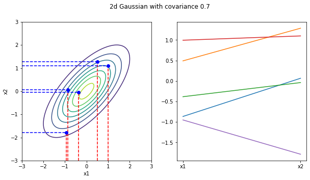
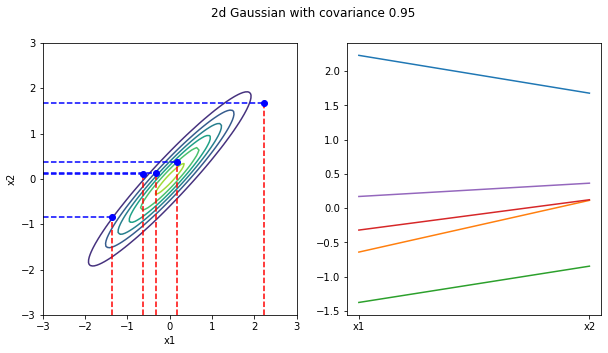
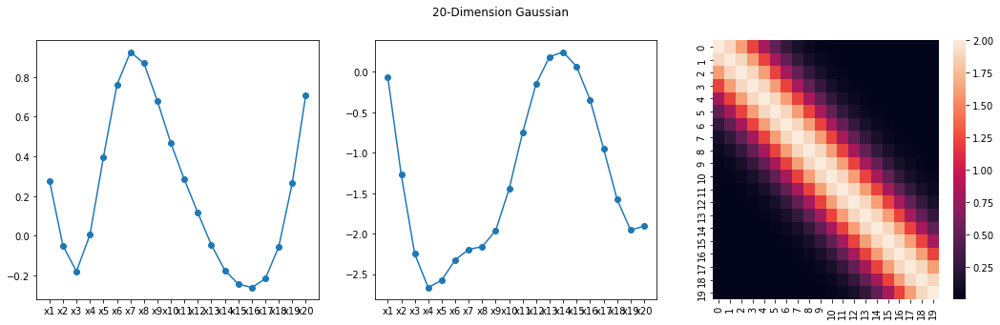
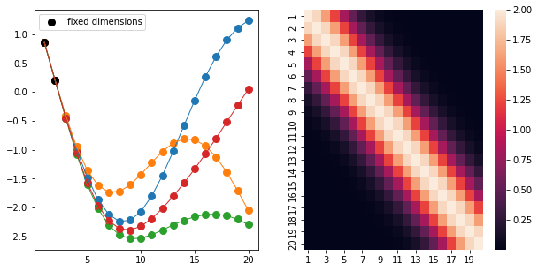

## Overview

In regression problem, we are actually looking for a function that maps input $x$ to output $y$. There are commonly two approaches: 1. We restrict the function space/form (linear, quadratic,...) and optimize their weights to approximate the true function. The problem with this approach is that we need to decide what kind of functions to use, and if the chosen type of function does not naturally match the underlying function, we can never obatin a well-apprxoimated function by only adjusting the weights. 2. The second considers arbitrary functions and chooses the one that fits the given sample $(X, Y)$ more closely (greater likelihood). The problem with this method is that it needs to consider an infinite number of functions, but this is not possible and thus requires the use of the Gaussian process in the title.

Firstly, I will give the definition of [Gaussian Process](https://en.wikipedia.org/wiki/Gaussian_process) from wikipedia: A Gaussian process is a stochastic process (a collection of random variables indexed by time or space) such that every finite collection of those random variables forms a multivariate normal distribution. Remark: **Every finite collection of those random variables forms a multivariate normal distribution**. This property will be our panacea for any upcoming troubles!
correlation

### 1. Two-dimensional Gaussian distribution
From the above definition, it is clear that any number of random variables form a Gaussian distribution. To simplify the problem, we firstly take two of these random variables such that $(x_1,x_2)\sim\mathcal{N}(\mu,\Sigma)$. Three pictures below: (left) Density contours of the distribution. (right) Sampled values of the random variables $x_1,x_2$.

*cov(x1,x2)=0*

*cov(x1,x2)=0.7*

*cov(x1,x2)=0.95*
As you can see from the graph above, as the correlation between $x_1,x_2$ gets larger, the values of $x_1$ and $x_2$ that we sample become more and more similar. (As can be expected, when the correlation is close to 1, no matter how many times we sample, $x_1$ is always equal to $x_2$. 

### 2. High-dimensional Gaussian distribution
The simple two-dimensional case was studied, let's now extend to 20 dimensions.

*20-dimensional Gaussian distribution*
The two left figures above, same as in 2D case, are sampled values for $(x_1,x_2,...x_{20})$$ obtained from a 20-dimensional Gaussian distribution (Do the shown curves look like the non-linear regressions?) The right panel shows the covariance matrix, where you can see that variables has a strong correlation with their neighbors (also reflected in the two panes on the left, where the adjacent variables do not vary largely, thus making the whole curve very smooth.)

What if we fix two random variables and sample again?

What if we viewed the two given random variables as given samples in the regression problem? The graph above can be seen as generating four curves that exactly fit the sample. Using the idea of averaging, we sample many curves and then take the average as our regression curve, but this is costly. Luckily, recalling the previous definition of a Gaussian process, the 20 random variables follow a twenty-dimensional Gaussian distribution, and their conditional probability distribution remains a Gaussian distribution according to the properties of the Gaussian distribution.
<!-- ### [❤️ Click here to become a sponsor and help support Wowchemy's future ❤️](https://wowchemy.com/sponsor/)

As a token of appreciation for sponsoring, you can **unlock [these](https://wowchemy.com/sponsor/) awesome rewards and extra features 🦄✨**

## Ecosystem

- **[Hugo Academic CLI](https://github.com/wowchemy/hugo-academic-cli):** Automatically import publications from BibTeX

## Inspiration

[Check out the latest **demo**](https://academic-demo.netlify.com/) of what you'll get in less than 10 minutes, or [view the **showcase**](https://wowchemy.com/user-stories/) of personal, project, and business sites.

## Features

- **Page builder** - Create _anything_ with [**widgets**](https://wowchemy.com/docs/page-builder/) and [**elements**](https://wowchemy.com/docs/content/writing-markdown-latex/)
- **Edit any type of content** - Blog posts, publications, talks, slides, projects, and more!
- **Create content** in [**Markdown**](https://wowchemy.com/docs/content/writing-markdown-latex/), [**Jupyter**](https://wowchemy.com/docs/import/jupyter/), or [**RStudio**](https://wowchemy.com/docs/install-locally/)
- **Plugin System** - Fully customizable [**color** and **font themes**](https://wowchemy.com/docs/customization/)
- **Display Code and Math** - Code highlighting and [LaTeX math](https://en.wikibooks.org/wiki/LaTeX/Mathematics) supported
- **Integrations** - [Google Analytics](https://analytics.google.com), [Disqus commenting](https://disqus.com), Maps, Contact Forms, and more!
- **Beautiful Site** - Simple and refreshing one page design
- **Industry-Leading SEO** - Help get your website found on search engines and social media
- **Media Galleries** - Display your images and videos with captions in a customizable gallery
- **Mobile Friendly** - Look amazing on every screen with a mobile friendly version of your site
- **Multi-language** - 34+ language packs including English, 中文, and Português
- **Multi-user** - Each author gets their own profile page
- **Privacy Pack** - Assists with GDPR
- **Stand Out** - Bring your site to life with animation, parallax backgrounds, and scroll effects
- **One-Click Deployment** - No servers. No databases. Only files.

## Themes

Wowchemy and its templates come with **automatic day (light) and night (dark) mode** built-in. Alternatively, visitors can choose their preferred mode - click the moon icon in the top right of the [Demo](https://academic-demo.netlify.com/) to see it in action! Day/night mode can also be disabled by the site admin in `params.toml`.

[Choose a stunning **theme** and **font**](https://wowchemy.com/docs/customization) for your site. Themes are fully customizable.

## License

Copyright 2016-present [George Cushen](https://georgecushen.com).

Released under the [MIT](https://github.com/wowchemy/wowchemy-hugo-themes/blob/master/LICENSE.md) license. -->
